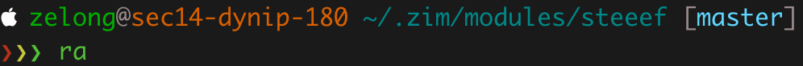

# steeef

A customizable version of [steeef's] theme, and this theme is modified based on [steef zimfw theme](https://github.com/zimfw/steeef).

I made the modification to display the apple icon , and also some customized settings, please see below screenshot ...

## What does it show?

  * *NEW: An apple icon *
  * "`user` at `hostname` in `working directory`"
  * Git branch name, or commit short hash when in ['detached HEAD' state].
    Also, unindexed, indexed, and untracked indicators, and an optional stashed
    indicator (must be customized, see below).
  * Python [venv] indicator.

## Settings

> *All of the setting can be customized by yourself.*

This theme can be customized with the following environment variables. If the
variable is not defined, the respective default value is used. There are default
colors for 256-color terminals (or otherwise).

| Variable        | Description             | Default value    |
| --------------- | ----------------------- | ---------------- |
| USER_COLOR      | User name color         | 34 (or green) |
| HOST_COLOR      | Host name color         | 166 (or yellow)  |
| PWD_COLOR       | Working directory color | 30 (or green)   |
| BRANCH_COLOR    | Git branch name color   | 81 (or cyan)     |
| UNINDEXED_COLOR | Git unindexed color     | 166 (or yellow)  |
| UNINDEXED_IND   | Git unindexed indicator | ●                |
| INDEXED_COLOR   | Git indexed color       | 118 (or green)   |
| INDEXED_IND     | Git indexed indicator   | ●                |
| UNTRACKED_COLOR | Git untracked color     | 161 (or red)     |
| UNTRACKED_IND   | Git untracked indicator | ●                |
| STASHED_COLOR   | Git stashed color       |                  |
| STASHED_IND     | Git stashed indicator   |                  |

The git stashed indicator will not be shown unless defined.

## How to use?

- Clone this repository to your `zim module` folder (you are expected to find other themes here):  
For me, it is `~/.zim/modules/steeef`.
- Make any customized modification as you want :wink:.

## Requirements

Requires Zim's [git-info] module to show git information.

[steeef's]: https://github.com/robbyrussell/oh-my-zsh/blob/master/themes/steeef.zsh-theme
['detached HEAD' state]: https://git-scm.com/docs/git-checkout#_detached_head
[venv]: https://docs.python.org/3/library/venv.html
[git-info]: https://github.com/zimfw/git-info
